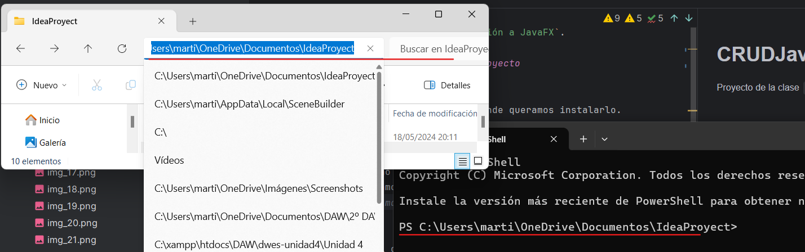
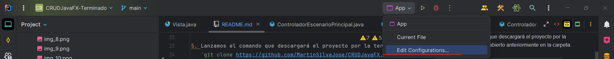
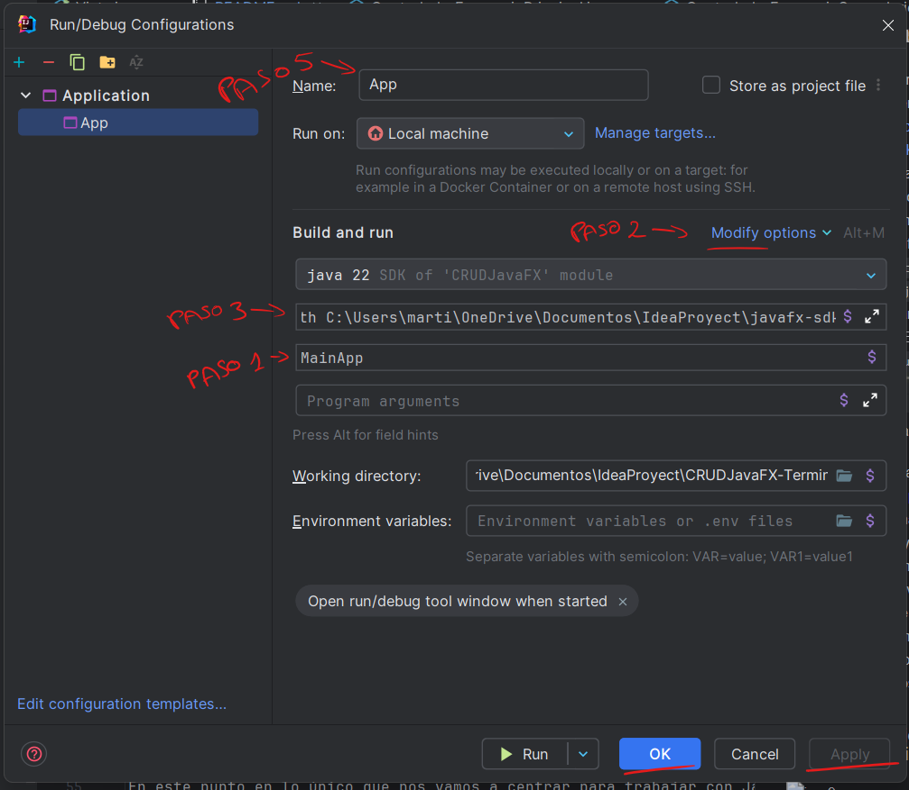
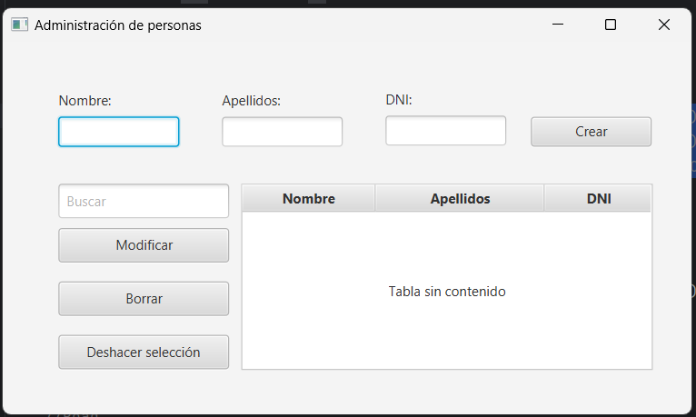
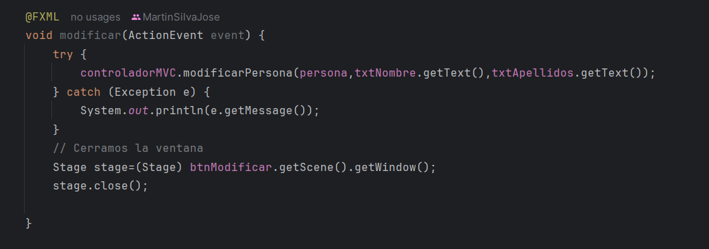

# CRUDJavaFX
 Proyecto de la clase `Introducción a JavaFX`.

## Descarga e instalación del proyecto

1. Nos ubicamos en la carpeta donde queramos instalarlo.

2. Clic derecho sobre la carpeta hasta que nos aparezca "Abrir en terminal".   
   Nos aseguramos de que la ruta de la terminal sea la misma que la de la carpeta

3. Lanzamos el comando `git --version`. (Si lo tenemos instalado pasamos al punto 5)

4. Instalamos git en el caso de que no nos haya reconocido el comando.  
   https://git-scm.com/download/win Comprobamos que esté instalado con `git --version`.
  

5. Lanzamos el comando que descargará el proyecto por la terminal que habíamos abierto anteriormente en la carpeta.  
   `git clone https://github.com/MartinSilvaJose/CRUDJavaFX.git`

## Configuración inicial

1. Nos descargamos el SDK de JavaFX.  
   Os lo facilito en este Link https://drive.google.com/file/d/1wVZT3pe-Ajp58jJgLPoLKXTy810iMxr1/view?usp=sharing  
2. Una vez descargado lo descomprimimos en la carpeta donde hemos clonado el proyecto.

3. A continuación, nos dirigimos a la carpeta lib del SDK y copiáis su ruta y modificáis el siguiente script con ella.  
   `--module-path BORRA LO MAYÚSCULA PARA PEGAR LA RUTA --add-modules javafx.controls,javafx.fxml`
4. Cuando tengamos nuestra ruta, vamos a editar la configuración de arranque.
   En la cabecera de nuestro IntelliJ nos vamos a `Edit Configurations`.

Añadimos una nueva run configurations Applications.

5. Una vez añadamos la nueva configuración tenemos que seguir los siguientes pasos.
   1. Seleccionar la clase MainApp.
   2. En modify options seleccionamos Add VM options.
   3. En el nuevo input que nos ha aparecido introducimos el script que hemos creado con la ruta del SDK de JavaFX
   4. Por último ponemos el nombre App, aplicamos los cambios y le damos a OK.

### Finálmente ejecutamos el proyecto y debería de aparecer lo siguiente.

## Desarrollo del CRUD

En este punto en lo único que nos vamos a centrar para trabajar con JavaFX es en estas 3 clases  

Ahora lo que debemos de hacer es que el controlador de nuestro MVC (vamos a llamarlo controladorMVC) y nuestro controlador de JavaFX (que llamaremos controladorJFX) se comuniquen entre sí.  
  
¿Como vamos a lograr eso? Fácil, setteándolos.  
  
Declaramos una variable en el controladorJFX, este va a ser nuestro controladorMVC. Seguídamente creamos el método público setControladorMVC para poder llamarlo desde el constructor en la vista y pasarle el controladorMVC QUE TIENE ELLA.

Ahora en el momento de nosotros llamar a nuestro archivo FXML en la vista le pasamos el controladorMVC al controladorJFX.

### Create
#### En el archivo .fxml
Lo primero que vamos a hacer es la creación de una nueva persona, para ello tendremos que establecer los id´s de cada uno de los inputs.

Lo segundo que tenemos que hacer es establecer en el botón de crear es el método que se encargará de hacerlo.

Por último guardamos y obtenemos los id´s del esqueleto del FXML.

#### En el controladorJFX
Vamos a especificar las zonas para determinar que esta es la parte de la creación de la persona y pegamos lo copiado del archivo FXML.
  
Los tipos de datos que no tenemos importados lo importamos siempre de JavaFX. Si no tenéis claro que paquete tenéis que importar, visualizar que importaciones se muestra en el esqueleto para el archivo FXML  
  
Por último vamos a desarrollar el método, para ello debemos de obtener los datos que haya introducido el usuario en cada uno de los campos para crear una nueva persona.

### Read

#### En el archivo .fxml
Para poder mostrar la lista de las personas tenemos que asignar tanto la tabla como las columnas de la tabla a un id.

#### En el controladorJFX
Vamos a especificar las zonas para determinar que esta es la parte de la lectura de la persona y pegamos lo copiado del archivo FXML.

Para que la tabla se llene con los datos debemos de darle los tipos tal y como se indican en la imagen. Esto hace referencia al tipo de dato que va a contener la tabla.  
  
Como se puede apreciar no tenemos ningún método que nos muestre las personas en la tabla, esto es porque vamos a utilizar un método reservado de JavaFX que se llama `initialize`.  
Este método se ejecuta cuando se carga la vista, por lo que es el lugar perfecto para cargar los datos en la tabla.

### Update

#### En el archivo .fxml
Para actualizar una persona vamos a necesitar poder seleccionarla y lanzar un segundo escenario pasándole los datos de la persona seleccionada.  
Para ello vamos solo vamos a necesitar el método del botón modificar.

#### En el controladorJFX
Aquí es donde vamos a tener que hacer un poco más de trabajo.
##### En el controladorEscenarioPrincipal

##### En el controladorEscenarioSecundario
Creamos el constructor de la misma manera que en el controladorEscenarioPrincipal con el añadido de que ahora le pasamos a una persona.  

A continuación vamos a irnos a su respectivo FXML y vamos a crear y añadir los id´s de los campos que vamos a necesitar para modificar la persona.  
  
Debemos de tener en cuenta que el dni no se puede modificar, pero igualmente lo mostraremos deshabilitado, además, deberemos de darle una id al botón de modificar para poder salir de la ventana al pulsarlo.

En este punto ya podemos cargar los datos de la persona en los campos correspondientes. Esto lo haremos gracias al método `initialize` que se ejecuta cuando se carga el archivo FXML.

Por último, vamos a desarrollar el método que se encargará de modificar la persona.

### Delete

#### En el archivo .fxml
Para eliminar es sencillo establecemos el método que se encargará de hacerlo en el botón eliminar como en el apartado de Update.  

#### En el controladorJFX
